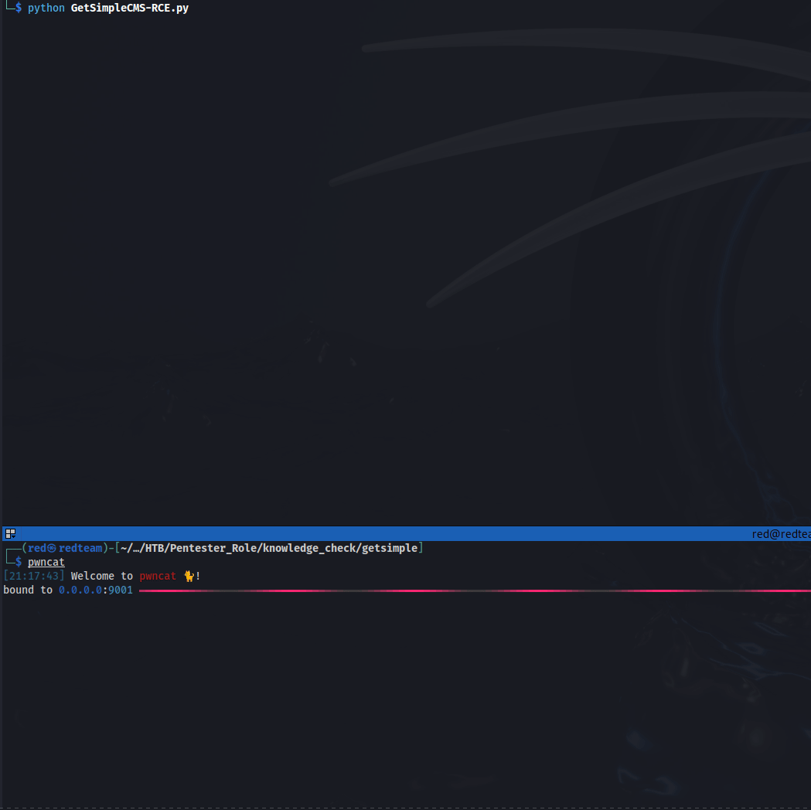

# GetSimpleCMS Exploit

This script exploits a vulnerability in GetSimpleCMS version 3.3.15, allowing for unauthenticated remote code execution (RCE). The exploit leverages an arbitrary file upload vulnerability which can be triggered by leaking the CMS API key and targeting the session manager.

## Features

- Detects GetSimpleCMS version
- Retrieves necessary values (version, salt, username)
- Generates a session cookie
- Retrieves the nonce
- Uploads a PHP payload to achieve RCE
- Executes the provided command on the target server

## Requirements

- Python 3.x
- `requests` library
- `beautifulsoup4` library

## Installation

1. Clone the repository:

```bash
git clone https://github.com/yourusername/GetSimpleCMS-Exploit.git
cd GetSimpleCMS-Exploit
```


2. Install the required Python libraries:

```bash
pip install requests beautifulsoup4
```

## Usage

1. Run the script:

```bash
python GetSimpleCMS-RCE.py
```

2. Follow the prompts to enter the target URL and the command to execute.

## Examples

```plaintext
 _______  _______ _________   _______ _________ _______  _______  _        _______    _______  _______  _______             _______  _______  _______ 
(  ____ \(  ____ \\__   __/  (  ____ \\__   __/(       )(  ____ )( \      (  ____ \  (  ____ \(       )(  ____ \           (  ____ )(  ____ \(  ____ \
| (    \/| (    \/   ) (     | (    \/   ) (   | () () || (    )|| (      | (    \/  | (    \/| () () || (    \/           | (    )|| (    \/| (    \/
| |      | (__       | |     | (_____    | |   | || || || (____)|| |      | (__      | |      | || || || (_____    _____   | (____)|| |      | (__    
| | ____ |  __)      | |     (_____  )   | |   | |(_)| ||  _____)| |      |  __)     | |      | |(_)| |(_____  )  (_____)  |     __)| |      |  __)   
| | \_  )| (         | |           ) |   | |   | |   | || (      | |      | (        | |      | |   | |      ) |           | (\ (   | |      | (      
| (___) || (____/\   | |     /\____) |___) (___| )   ( || )      | (____/\| (____/\  | (____/\| )   ( |/\____) |           | ) \ \__| (____/\| (____/\
(_______)(_______/   )_(     \_______)\_______/|/     \||/       (_______/(_______/  (_______/|/     \|\_______)           |/   \__/(_______/(_______/                                                                                                                                               
    
Created By: H088yHaX0R / (HTB - AKA: Marz0)

Works for GetSimpleCMS 3.3.15

Enter the target URL (e.g., http://gettingstarted.htb): http://target-site.com
Enter the command to execute: id
[+] GetSimpleCMS version 3.3.15 detected.
[+] Theme edit successful!
uid=33(www-data) gid=33(www-data) groups=33(www-data)

[*] Press Ctrl+C to exit.
[+] User aborted the script.
```




## Code Explanation

The script is structured into a class GetSimpleCMSExploit which contains the following methods:

* **`__init__:`** Initializes the class with the target URL and command.
* **`check_vulnerability:`** Checks if the target is vulnerable by retrieving the CMS version and checking for necessary files.
* **`gscms_version:`** Retrieves the CMS version from the admin page.
* **`get_salt:`** Retrieves the salt value from the authorization.xml file.
* **`get_user:` **Retrieves the username from the users directory.
* **`gen_cookie:`** Generates a session cookie using the version, salt, and username.
* **`get_nonce:`** Retrieves the nonce value required for the POST request.
* **`upload_file:`** Uploads a PHP file to the server using the provided cookie and nonce.
* **`vulnerable:`** Checks if the target is vulnerable by attempting to access sensitive files.
* **`exploit:`** Executes the exploit by performing the above steps and uploading a PHP payload.

The script also includes a print_banner function to display a colorful banner, and the main execution block which handles user input and runs the exploit.

## Disclaimer

This script is for educational purposes only. Use it responsibly and only on systems you have permission to test. The author is not responsible for any misuse of this tool.

---
